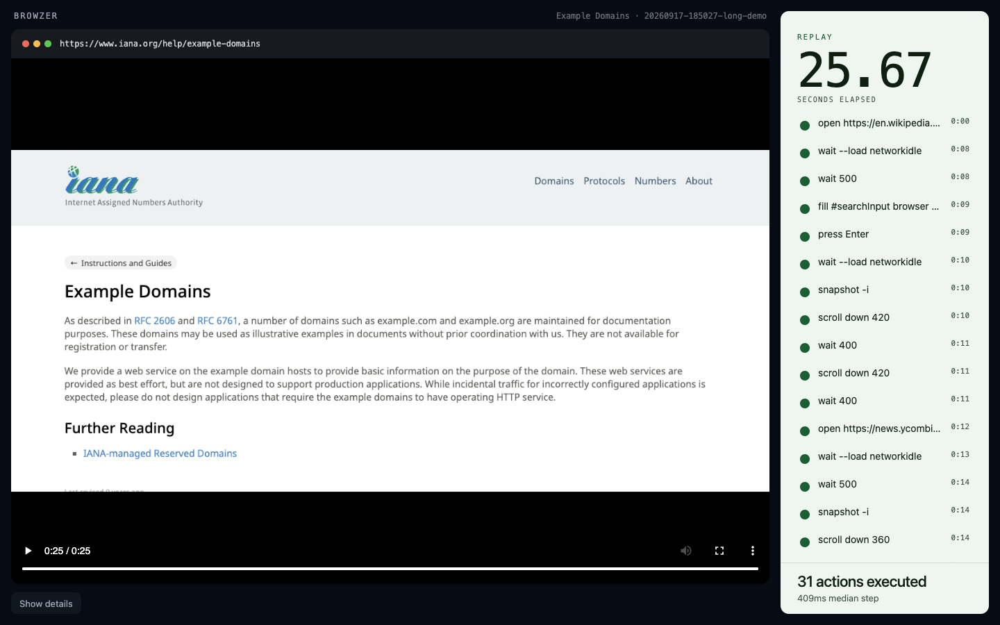

# Browzer

`browzer` is [agent-browser](https://agent-browser.dev) with a trace. Same commands, same snapshot-and-click loop. Each session is saved so you can inspect it later or open a local HTML replay.

Live watching stays with `agent-browser dashboard`. Browzer is the bundle you keep after `close`.



## Install

Needs Node 18+, [agent-browser](https://agent-browser.dev) on `PATH`, and [ffmpeg](https://ffmpeg.org/) on `PATH` (for video).

```bash
npm i -g @agentuity/browzer
```

Confirm:

```bash
browzer help
agent-browser --version
ffmpeg -version
```

Install the Agent Skill so Claude Code, Cursor, Codex, Grok, and others treat `browzer` as the browser CLI when a recording is wanted:

```bash
browzer skills install
```

## Quick start

```bash
export AGENT_BROWSER_SESSION=demo
export AGENT_BROWSER_IDLE_TIMEOUT_MS=0

browzer --session demo open https://example.com
browzer --session demo snapshot -i
browzer --session demo find text "Learn more" click
browzer --session demo close

browzer traces
browzer inspect demo
browzer replay demo
```

Every `browzer` invocation except `dashboard`, `mcp`, `doctor`, `install`, `upgrade`, and `session` metadata is the same argv you would have passed to `agent-browser`. Do not also run `agent-browser` on that `--session`.

## How a trace is captured

On the first successful command for a session, Browzer starts:

- `record start` → `session.mp4`
- `network har start --content text` → `network.har`

While commands run, it appends:

- `commands.jsonl` — argv, duration, exit, stdout/stderr
- `events.jsonl` — stream `command` / `result` / `url` / `tabs`
- `console.jsonl` — console and page errors from the stream

On `close` it dumps `console.json`, `errors.json`, `snapshot.txt`, `poster.jpg`, stops recording and HAR, and writes `summary.md`.

Traces are written under the current directory as `<id>/` unless you pass `--output` / `-o` or set `BROWZER_OUTPUT`. Session bookkeeping still uses `~/.browzer/active` (override the home with `BROWZER_HOME`). Override the wrapped binary with `AGENT_BROWSER_BIN`.

```bash
browzer --output ./artifacts --session demo open https://example.com
browzer --output ./artifacts traces
browzer --output ./artifacts replay demo
```

## Commands Browzer adds

| Command | What it does |
|---|---|
| `browzer traces` | List traces |
| `browzer traces --json` | Same, JSON |
| `browzer inspect [id]` | Print `summary.md` (latest if omitted) |
| `browzer replay [id\|path]` | Write `replay.html` next to the video and open it |
| `browzer skills` | List the bundled skill |
| `browzer skills get` | Print `SKILL.md` matching this CLI |
| `browzer skills install` | Copy the skill into `~/.agents`, plus Claude / Cursor / Codex / Grok if those dirs exist |
| `browzer skills install --project` | Copy into this repo’s agent skill folders |

Everything else is forwarded to `agent-browser`.

## Replay

```bash
browzer replay                 # latest
browzer replay demo            # id, prefix, or session suffix
browzer replay ./20260917-185027-long-demo
```

The page is a static HTML file beside `session.mp4`. No app server. The URL bar follows the playhead. Steps seek the video. Console, network, errors, and snapshot sit behind **Show details**.

## After a failure

Agents should read `browzer inspect` first (failed commands, HAR 4xx/5xx, console errors). Humans open `browzer replay`. Live CDP-style inspection during a run is `agent-browser dashboard start` at http://localhost:4848.

## Skill

Canonical file: [`skills/browzer/SKILL.md`](skills/browzer/SKILL.md). Same Agent Skills format used by Claude Code, Cursor, Codex, and Grok. It is a prefix swap: same commands as agent-browser, invoke `browzer`. Snapshot/click/fill details stay in the agent-browser core skill.
